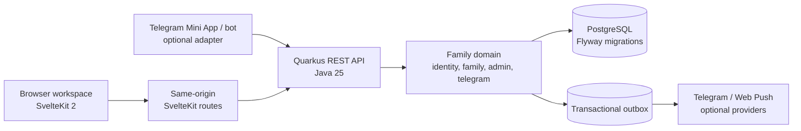

# EarnIt Kids

EarnIt Kids is a family reward workspace: parents define tasks and rewards,
children complete approved work, and both sides see the same family-scoped
state. The web app provides the browser workspace and public entrypoints;
Telegram is an optional Mini App and bot adapter over the same backend domain.

The system keeps authorization and family ownership on the server, verifies
Telegram input cryptographically, makes state-changing actions transactional,
and persists external notifications before delivery. These boundaries are
shared by the browser and Telegram entrypoints rather than implemented as
separate business rules.

## Architecture



The active runtime is a modular Quarkus monolith behind a SvelteKit edge.
PostgreSQL is authoritative; Flyway owns schema evolution. Telegram does not
duplicate family or balance rules: it authenticates a Telegram identity and
calls the same family application services as the web path.

## Product surfaces

| Surface | What it demonstrates |
| --- | --- |
| [Parent workspace](apps/web/static/public/assets/screenshots/parent-home.png) | Review requests, award coins, inspect history, and switch family areas |
| [Task management](apps/web/static/public/assets/screenshots/parent-tasks.png) | Parent-owned task catalog with groups and coin values |
| [Child Today view](apps/web/static/public/assets/screenshots/child-today.png) | Child-scoped work and explicit completion states |
| [Telegram Mini App](apps/web/static/public/assets/screenshots/miniapp-home.png) | The same family workflow hosted inside Telegram |

Screenshots use demo data. No production account, family, child, payment, or
credential data is part of the public assets.

## Engineering decisions with evidence

- **Family-scoped authorization.** Sessions carry the active family and role;
  services and repositories validate family/child ownership server-side. See
  [`AuthFilter`](apps/backend/src/main/java/com/sashplatonov/earnit/kids/config/auth/AuthFilter.java),
  [`FamilyActionSupportService`](apps/backend/src/main/java/com/sashplatonov/earnit/kids/family/application/action/FamilyActionSupportService.java),
  and the [backend authorization contract](apps/backend/docs/ARCHITECTURE.md#-authentication-and-authorization).
- **Verified Telegram admission.** Telegram `initData` is checked for a valid
  signature and age before a Mini App session is created. See
  [`TelegramInitDataVerifier`](apps/backend/src/main/java/com/sashplatonov/earnit/kids/telegram/application/identity/TelegramInitDataVerifier.java)
  and its [characterization test](apps/backend/src/test/java/com/sashplatonov/earnit/kids/telegram/application/identity/TelegramInitDataVerifierTest.java).
- **Transactional state plus delivery boundary.** Domain changes publish an
  application outbox record in the same transaction; workers claim records and
  deliver them later. See
  [`ApplicationEventPublisher`](apps/backend/src/main/java/com/sashplatonov/earnit/kids/service/event/ApplicationEventPublisher.java),
  [`ApplicationOutboxEventEntity`](apps/backend/src/main/java/com/sashplatonov/earnit/kids/family/domain/model/outbox/ApplicationOutboxEventEntity.java),
  and [`TelegramOutboxProcessor`](apps/backend/src/main/java/com/sashplatonov/earnit/kids/telegram/application/notification/TelegramOutboxProcessor.java).
- **Concurrency protection at the persistence boundary.** Pessimistic locks
  protect coin mutations, pending requests, callbacks, invitations, and
  delivery claims instead of relying on browser ordering. See
  [`ChildRepository`](apps/backend/src/main/java/com/sashplatonov/earnit/kids/family/infrastructure/persistence/child/ChildRepository.java)
  and the [backend verification map](apps/backend/docs/ARCHITECTURE.md#-scope).
- **Database evolution is explicit.** Production and test migration chains are
  maintained with Flyway; repository predicates and indexes remain visible in
  the [backend architecture guide](apps/backend/docs/ARCHITECTURE.md#️-database-overview).
- **Operational observability is backend-owned.** Health checks, structured
  logs, trace correlation, HTTP metrics, and optional New Relic export are
  implemented as runtime contracts, documented in the
  [monitoring runbook](docs/monitoring/newrelic.md).

## Stack

- **Backend:** Java 25, Quarkus 3, JAX-RS, Hibernate ORM, Flyway, SmallRye Health/OpenAPI
- **Web:** SvelteKit 2, TypeScript, Vite, Vitest, Playwright, adapter-node
- **Data:** PostgreSQL 18 locally; H2 is used for selected fast tests
- **Delivery:** Docker Compose with JVM and native-image backend modes

## Internationalization

EarnIt Kids supports `en` and `ru` initially. Public pages are visitor-owned
and use `/{locale}/...` canonical URLs, resolved in this order: URL, cookie,
`Accept-Language`, then `en`. Authenticated workspace, Telegram Mini App, and
Telegram Bot presentation use one normalized family locale (`en` or `ru`)
chosen by a family administrator; it overrides browser and Telegram hints.
Unconfigured families fall back to `en` for non-administrators while their
administrator completes setup. See [ADR 0001](docs/adr/0001-internationalization-strategy.md)
for the API error contract, translation ownership, normalization rules, and
the extension workflow for future locales.

## Local start and verification

From the repository root, run these five commands:

```bash
cp .env.example .env
docker compose --profile db up -d --build
docker compose ps
(cd apps/backend && ./mvnw -B -ntp verify)
(cd apps/web && npm ci && npm run lint && npm run test && npm run build)
```

The default local stack starts without Google or Telegram credentials. Those
integrations are disabled until their feature flags and provider settings are
configured. The web/backend path remains usable with the safe local defaults.

Useful local endpoints:

- Web: `http://localhost:3000`
- Backend health: `http://localhost:8080/q/health`
- Backend OpenAPI: `http://localhost:8080/api/openapi.yaml`

## Repository map

```text
apps/backend/   Quarkus API, domain services, persistence, migrations
apps/web/       SvelteKit public pages, workspace, Telegram surface, tests
docs/           Operations and monitoring runbooks
```

For deeper contracts, read the [backend architecture](apps/backend/docs/ARCHITECTURE.md),
[web architecture](apps/web/docs/ARCHITECTURE.md), and
[Web/Telegram operations runbook](docs/operations/web-miniapp-access.md).

## Privacy and release boundaries

The repository contains demo screenshots and local-safe fixtures only. Never
commit `.env`, OAuth or Telegram credentials, or VAPID private keys. Provider
secrets belong in the deployment secret manager. A local build proves source
and test behavior; it does not prove provider delivery, a deployed
configuration, or an official Telegram client launch. The web edge and API
apply baseline browser protections, including Content Security Policy and
Permissions Policy; deployment-specific headers and provider settings must be
checked at the public origin.

## Contributing

Keep changes scoped to one concern, preserve the family authorization boundary,
and add a focused test for behavior changes. Before opening a change, run the
backend `verify` gate and the web lint, test, and production build commands
above. Keep migrations sequential and update the relevant architecture or
operations document when a runtime contract changes.
