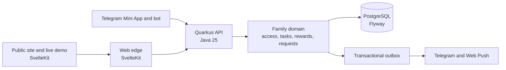
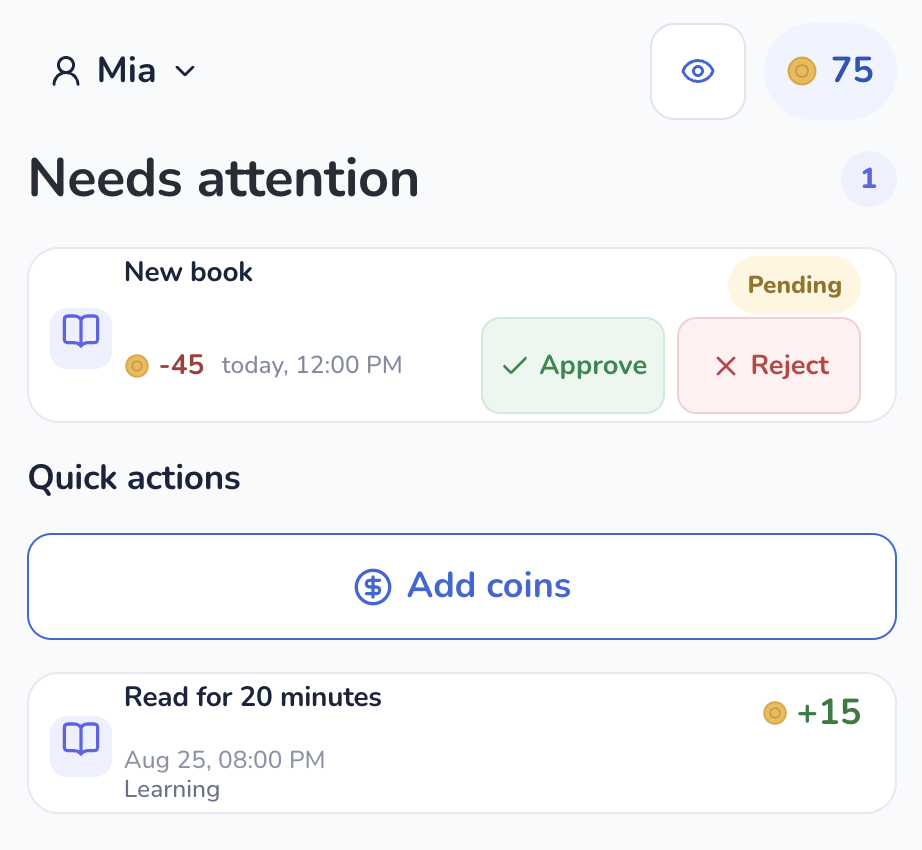
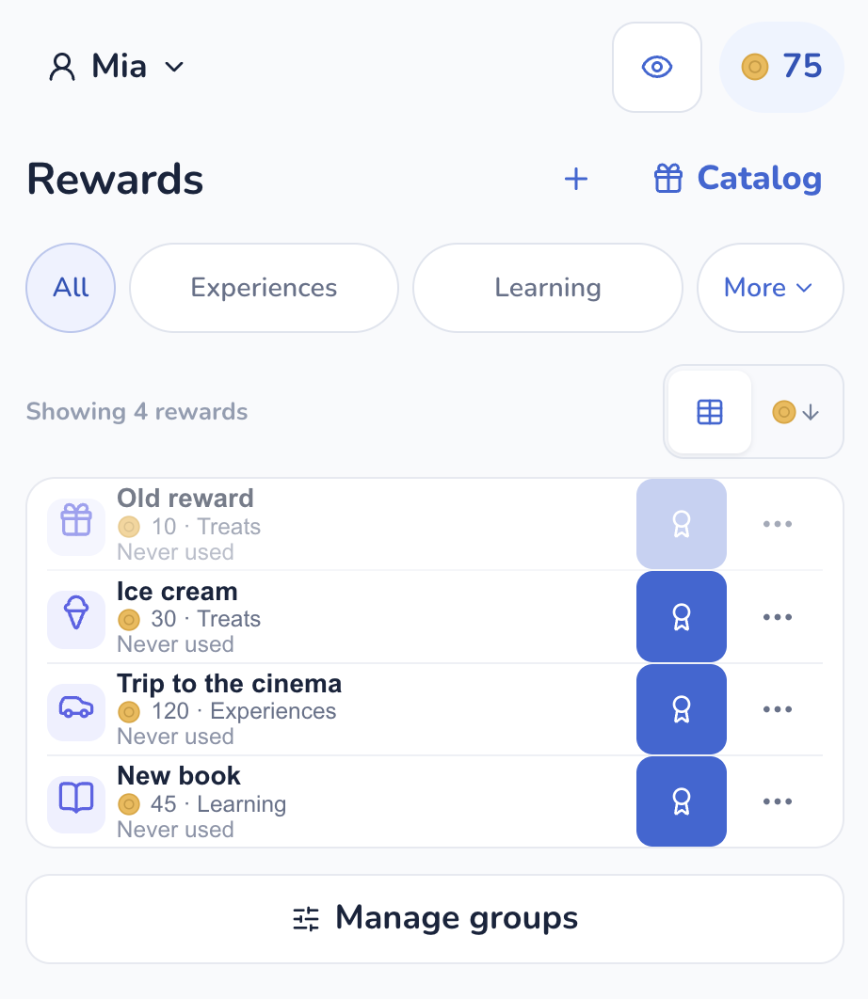

# EarnIt Kids

<a name="top"></a>

EarnIt Kids helps a family turn everyday tasks into small, visible rewards.
Parents manage the family; children complete tasks, earn coins, and ask for
rewards. The browser and Telegram use the same server-side family data.

<p align="center">
  <a href="https://earnit-kids.freeddns.org/demo">
    
  </a>
  <a href="https://t.me/@earnit_kids_bot?startapp=home">
    
  </a>
</p>

## Table of contents

- [EarnIt Kids](#earnit-kids)
  - [Table of contents](#table-of-contents)
  - [🚀 Run it locally](#-run-it-locally)
  - [🏗️ Project architecture](#️-project-architecture)
  - [👀 Parent workspace](#-parent-workspace)
  - [🧭 What lives where](#-what-lives-where)
  - [🔐 What the system protects](#-what-the-system-protects)
  - [🌍 Languages](#-languages)
  - [🧪 Check a change](#-check-a-change)
  - [📚 Further reading](#-further-reading)

## 🚀 Run it locally

Copy the safe local configuration, start PostgreSQL and the app containers,
then run the two quality gates from their own directories.

```bash
cp .env.example .env
docker compose --profile db up -d --build
(cd apps/backend && JAVA_HOME="$HOME/.sdkman/candidates/java/25.0.2-amzn" ./mvnw verify)
(cd apps/web && npm ci && npm run lint && npm run test && npm run build)
```

Useful local URLs:

- Web: `http://localhost:3000`
- API health: `http://localhost:8080/q/health`
- OpenAPI: `http://localhost:8080/api/openapi.yaml`
- Live, in-memory product demo: `http://localhost:4174/demo` after starting the web preview

⚠️ The default stack has no Google, Telegram, push, or New Relic credentials.
That is intentional: those integrations need real deployment configuration.

[↑ Back to top](#top)

## 🏗️ Project architecture



The browser and Telegram are entrypoints, not separate copies of the product.
The backend decides access and changes family state; the outbox delivers a
notification after the state change has been saved.

[↑ Back to top](#top)

## 👀 Parent workspace

These are fresh English-language captures of the current live coin shop. Click
either screen to open the demo in the browser.

<p align="center">
  <a href="https://earnit-kids.freeddns.org/demo">
    
  </a>
  <a href="https://earnit-kids.freeddns.org/demo">
    
  </a>
</p>

[↑ Back to top](#top)

## 🧭 What lives where

```text
apps/backend/   Quarkus API, family rules, database migrations, Telegram bot
apps/web/       SvelteKit public site, Telegram Mini App, live demo, browser tests
docs/           operator runbooks
```

The web app is the public edge and proxies browser API calls to Quarkus. The
backend is the source of truth for family membership, balances, requests, and
history. PostgreSQL stores the production state; Flyway changes its schema.

[↑ Back to top](#top)

## 🔐 What the system protects

- Every family read and write is checked against the authenticated family and role.
- Parent roles are `viewer`, `editor`, and `family_admin`; a child is always
  restricted to its own records.
- Telegram input is verified before it creates a session. Telegram actions call
  the same family services as the web app.
- State changes and outgoing notifications are recorded in one transaction;
  delivery happens afterwards from the outbox.
- Secrets never belong in the repository. Use the deployment secret manager
  for OAuth, Telegram, VAPID, and New Relic credentials.

[↑ Back to top](#top)

## 🌍 Languages

The product currently supports English and Russian. Public pages use the URL
locale; authenticated family screens and Telegram delivery use the family
locale selected by a family administrator. API identifiers and error codes stay
stable and language-neutral. Add visible copy to the catalog that owns it and
keep named placeholders identical in both languages.

[↑ Back to top](#top)

## 🧪 Check a change

Run the check that matches the files you changed. For a normal cross-stack
change, run both application gates:

```bash
(cd apps/backend && JAVA_HOME="$HOME/.sdkman/candidates/java/25.0.2-amzn" ./mvnw verify)
(cd apps/web && npm run lint && npm run test && npm run build)
```

For a UI change, also run the relevant Playwright spec. The public demo has no
backend traffic by design:

```bash
cd apps/web
npm run test:e2e -- --project=chromium tests/e2e/live-coin-shop-demo.spec.ts
```

✅ Local checks prove source behavior. They do not prove CI, deployed settings,
provider delivery, the Telegram client, or a physical device.

[↑ Back to top](#top)

## 📚 Further reading

- [Backend architecture](apps/backend/docs/ARCHITECTURE.md)
- [Web architecture](apps/web/docs/ARCHITECTURE.md)
- [Admin analytics definitions](apps/backend/docs/ADMIN_ANALYTICS.md)
- [Web and Telegram access runbook](docs/operations/web-miniapp-access.md)
- [New Relic monitoring runbook](docs/monitoring/newrelic.md)

[↑ Back to top](#top)
