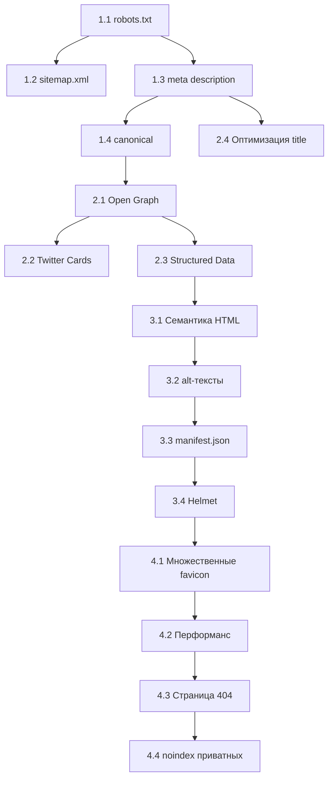

# 🔍 SEO-план: задачи для ИИ-агента

Проект: **Coins Kids Shop** (`coins-kids-shop-web`)

---

## Текущее состояние (аудит)

| Элемент | Статус |
|---|---|
| `robots.txt` | ❌ Отсутствует |
| `sitemap.xml` | ❌ Отсутствует |
| Canonical ссылки | ❌ Нигде не используются |
| Open Graph мета-теги | ❌ Отсутствуют |
| Twitter Card мета-теги | ❌ Отсутствуют |
| Schema.org (structured data) | ❌ Отсутствует |
| Meta description | ⚠️ Только в [head.html](file:///Users/sash/Dev/Projects/coins-kids-shop-web/views/components/head.html) (общий), отсутствует на [login.html](file:///Users/sash/Dev/Projects/coins-kids-shop-web/views/login.html), [about.html](file:///Users/sash/Dev/Projects/coins-kids-shop-web/public/about.html) |
| Security headers (Helmet) | ❌ Не подключен |
| [manifest.json](file:///Users/sash/Dev/Projects/coins-kids-shop-web/public/manifest.json) | ✅ Есть, но описание только на английском |
| Семантическая разметка HTML | ⚠️ Частично (есть `<main>`, `<article>`, но не везде) |
| Атрибуты `alt` у изображений | ⚠️ Есть, но не оптимизированы под SEO |
| `lang="ru"` | ✅ Установлен |
| PWA мета-теги | ✅ Есть |

---

## Задачи с приоритетами

### 🔴 Приоритет 1 — Критичные (без них поисковики не индексируют правильно)

---

#### Задача 1.1: Создать `robots.txt`
**Файл:** `public/robots.txt` [NEW]

**Что сделать:**
- Создать файл `robots.txt` в директории `public/`
- Разрешить индексацию публичных страниц ([/about.html](file:///Users/sash/Dev/Projects/coins-kids-shop-web/public/about.html), [/login.html](file:///Users/sash/Dev/Projects/coins-kids-shop-web/views/login.html))
- Запретить индексацию API-эндпоинтов (`/api/`)
- Запретить индексацию приватных страниц (основное приложение после авторизации)
- Указать путь к `sitemap.xml`

**Пример содержимого:**
```
User-agent: *
Allow: /about.html
Allow: /login.html
Disallow: /api/
Disallow: /super-admin
Sitemap: https://YOUR_DOMAIN/sitemap.xml
```

---

#### Задача 1.2: Создать `sitemap.xml`
**Файл:** `public/sitemap.xml` [NEW]

**Что сделать:**
- Создать XML sitemap со списком публичных страниц
- Включить: [/about.html](file:///Users/sash/Dev/Projects/coins-kids-shop-web/public/about.html), [/login.html](file:///Users/sash/Dev/Projects/coins-kids-shop-web/views/login.html)
- Указать `<lastmod>`, `<changefreq>`, `<priority>` для каждой страницы
- Обновить `robots.txt` ссылкой на sitemap

---

#### Задача 1.3: Добавить мета-теги description на все публичные страницы
**Файлы:** [views/login.html](file:///Users/sash/Dev/Projects/coins-kids-shop-web/views/login.html), [public/about.html](file:///Users/sash/Dev/Projects/coins-kids-shop-web/public/about.html), [views/verify.html](file:///Users/sash/Dev/Projects/coins-kids-shop-web/views/verify.html), [views/reset-password.html](file:///Users/sash/Dev/Projects/coins-kids-shop-web/views/reset-password.html)

**Что сделать:**
- Добавить уникальный `<meta name="description">` на каждую страницу:
    - **login.html**: «Войдите в семейный магазин монет — систему мотивации для детей. Зарабатывайте и тратьте монеты за задания.»
    - **about.html**: «Магазин Монеток — семейная система мотивации, где дети зарабатывают монеты за задания и обменивают их на награды.»
    - **verify.html**: «Подтверждение email для входа в Магазин Монеток.»
    - **reset-password.html**: «Сброс пароля для аккаунта в Магазине Монеток.»

---

#### Задача 1.4: Добавить canonical-ссылки
**Файлы:** [views/components/head.html](file:///Users/sash/Dev/Projects/coins-kids-shop-web/views/components/head.html), [views/login.html](file:///Users/sash/Dev/Projects/coins-kids-shop-web/views/login.html), [public/about.html](file:///Users/sash/Dev/Projects/coins-kids-shop-web/public/about.html)

**Что сделать:**
- Добавить `<link rel="canonical" href="...">` на каждую публичную страницу
- Canonical URL должен совпадать с фактическим адресом страницы
- Для серверно-собираемых страниц — использовать шаблонную переменную `{{CANONICAL_URL}}`

---

### 🟠 Приоритет 2 — Важные (влияют на отображение в поиске и соцсетях)

---

#### Задача 2.1: Добавить Open Graph мета-теги
**Файлы:** [views/components/head.html](file:///Users/sash/Dev/Projects/coins-kids-shop-web/views/components/head.html), [views/login.html](file:///Users/sash/Dev/Projects/coins-kids-shop-web/views/login.html), [public/about.html](file:///Users/sash/Dev/Projects/coins-kids-shop-web/public/about.html)

**Что сделать:**
- Добавить набор OG-тегов на каждую публичную страницу:
  ```html
  <meta property="og:type" content="website">
  <meta property="og:title" content="Магазин Монеток — мотивация для детей">
  <meta property="og:description" content="Семейная система, где дети зарабатывают и тратят монеты">
  <meta property="og:image" content="https://YOUR_DOMAIN/img/og-image.png">
  <meta property="og:url" content="https://YOUR_DOMAIN/">
  <meta property="og:locale" content="ru_RU">
  <meta property="og:site_name" content="Магазин Монеток">
  ```
- Создать OG-изображение 1200×630 px (использовать `generate_image`)

---

#### Задача 2.2: Добавить Twitter Card мета-теги
**Файлы:** те же, что и в 2.1

**Что сделать:**
- Добавить Twitter Card мета-теги:
  ```html
  <meta name="twitter:card" content="summary_large_image">
  <meta name="twitter:title" content="Магазин Монеток">
  <meta name="twitter:description" content="Мотивация для детей через систему монет">
  <meta name="twitter:image" content="https://YOUR_DOMAIN/img/og-image.png">
  ```

---

#### Задача 2.3: Добавить structured data (JSON-LD / Schema.org)
**Файлы:** [public/about.html](file:///Users/sash/Dev/Projects/coins-kids-shop-web/public/about.html), [views/components/head.html](file:///Users/sash/Dev/Projects/coins-kids-shop-web/views/components/head.html)

**Что сделать:**
- Добавить JSON-LD разметку для [about.html](file:///Users/sash/Dev/Projects/coins-kids-shop-web/public/about.html) (тип `WebApplication` или `SoftwareApplication`):
  ```html
  <script type="application/ld+json">
  {
    "@context": "https://schema.org",
    "@type": "WebApplication",
    "name": "Магазин Монеток",
    "description": "Семейная система мотивации для детей",
    "applicationCategory": "EducationalApplication",
    "operatingSystem": "Web",
    "offers": {
      "@type": "Offer",
      "price": "0",
      "priceCurrency": "RUB"
    }
  }
  </script>
  ```
- Для [head.html](file:///Users/sash/Dev/Projects/coins-kids-shop-web/views/components/head.html) добавить `Organization` schema

---

#### Задача 2.4: Оптимизировать `<title>` теги
**Файлы:** [views/components/head.html](file:///Users/sash/Dev/Projects/coins-kids-shop-web/views/components/head.html), [views/login.html](file:///Users/sash/Dev/Projects/coins-kids-shop-web/views/login.html), [public/about.html](file:///Users/sash/Dev/Projects/coins-kids-shop-web/public/about.html)

**Что сделать:**
- Убедиться, что каждая страница имеет уникальный, описательный `<title>`:
    - **head.html** (главная): `Магазин Монеток — Семейная система мотивации для детей`
    - **login.html**: `Вход | Магазин Монеток`
    - **about.html**: `О проекте | Магазин Монеток — Как работает система мотивации`
- Формат: `Ключевое слово | Бренд` (до 60 символов)

---

### 🟡 Приоритет 3 — Средние (повышают качество индексации)

---

#### Задача 3.1: Улучшить семантическую HTML-разметку
**Файлы:** [views/login.html](file:///Users/sash/Dev/Projects/coins-kids-shop-web/views/login.html), [public/about.html](file:///Users/sash/Dev/Projects/coins-kids-shop-web/public/about.html), `views/components/*.html`

**Что сделать:**
- Проверить иерархию заголовков: ровно один `<h1>` на страницу, далее `<h2>`, `<h3>` и т.д.
- Обернуть секции в `<section>`, `<article>`, `<nav>`, `<aside>` где уместно
- Добавить `<nav>` для навигационных элементов
- Использовать `<footer>` для подвала

---

#### Задача 3.2: Оптимизировать атрибуты `alt` у изображений
**Файл:** [public/about.html](file:///Users/sash/Dev/Projects/coins-kids-shop-web/public/about.html)

**Что сделать:**
- Обновить `alt`-тексты на ключевые описания с SEO-словами:
    - Текущее: `"Родитель и ребёнок обсуждают цели"` → «Семья обсуждает цели мотивации через Магазин Монеток»
    - Текущее: `"Семья обсуждает цели"` → «Родители и дети выбирают задания для заработка монет»
    - Текущее: `"Ребёнок планирует задания"` → «Ребёнок планирует задания в системе мотивации»
    - Текущее: `"Монеты и прогресс"` → «Прогресс выполнения заданий и баланс монет»

---

#### Задача 3.3: Обновить [manifest.json](file:///Users/sash/Dev/Projects/coins-kids-shop-web/public/manifest.json)
**Файл:** [public/manifest.json](file:///Users/sash/Dev/Projects/coins-kids-shop-web/public/manifest.json)

**Что сделать:**
- Изменить `description` на русский: `"Семейная система мотивации для детей. Зарабатывай и трать монеты за задания!"`
- Добавить поле `lang: "ru"`
- Добавить отдельные иконки правильных размеров (192×192 и 512×512) если их нет

---

#### Задача 3.4: Добавить Helmet (security headers)
**Файлы:** [src/app.js](file:///Users/sash/Dev/Projects/coins-kids-shop-web/src/app.js) или основной Express файл

**Что сделать:**
- Установить пакет `helmet`
- Подключить middleware для HTTP security headers
- Это косвенно влияет на SEO: Google учитывает HTTPS, CSP, и другие заголовки

---

### 🟢 Приоритет 4 — Хорошо бы сделать (polish)

---

#### Задача 4.1: Добавить favicon в нескольких форматах
**Файлы:** [views/components/head.html](file:///Users/sash/Dev/Projects/coins-kids-shop-web/views/components/head.html), `public/img/`

**Что сделать:**
- Создать favicon в форматах: `.ico` (16×16, 32×32), `.png` (192×192, 512×512), `.svg`
- Добавить все `<link>` теги
- Сейчас используется один `favicon.png` для всех размеров

---

#### Задача 4.2: Оптимизировать производительность загрузки
**Файлы:** `views/components/head.html`

**Что сделать:**
- Добавить `preload` для критических ресурсов (основной CSS)
- Перенести скрипты `marked.min.js` и `chart.js` в конец `<body>` или загружать с `defer`
- Рассмотреть self-hosting шрифтов вместо Google Fonts для ускорения
- Добавить `<meta http-equiv="X-DNS-Prefetch-Control" content="on">`

---

#### Задача 4.3: Добавить страницу 404
**Файлы:** `views/404.html` [NEW], маршруты Express

**Что сделать:**
- Создать красивую 404-страницу с навигацией обратно
- Добавить `<meta name="robots" content="noindex">` чтобы не индексировалась
- Подключить к Express catch-all маршруту

---

#### Задача 4.4: Добавить `noindex` на приватные страницы
**Файлы:** `views/verify.html`, `views/reset-password.html`, `views/super-admin.html`

**Что сделать:**
- Добавить `<meta name="robots" content="noindex, nofollow">` на страницы, которые не должны индексироваться

---

## Порядок выполнения (рекомендуемый)



---

## Проверка результатов

| Инструмент | Что проверяет |
|---|---|
| [Google Search Console](https://search.google.com/search-console) | Индексация, ошибки покрытия |
| [PageSpeed Insights](https://pagespeed.web.dev/) | Core Web Vitals, SEO-скор |
| [Schema Markup Validator](https://validator.schema.org/) | Корректность structured data |
| [Open Graph Debugger (Facebook)](https://developers.facebook.com/tools/debug/) | Превью OG-тегов |
| [Twitter Card Validator](https://cards-dev.twitter.com/validator) | Превью карточек |
| `curl -I https://domain.com` | Security headers |
| Lighthouse в Chrome DevTools | Общий SEO audit |
