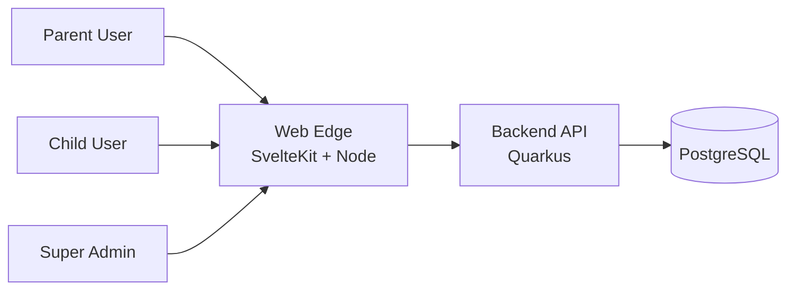
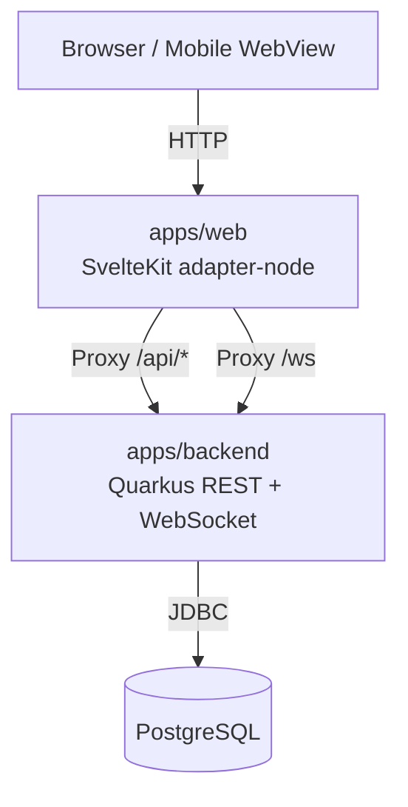
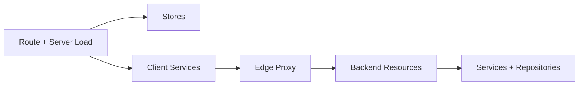
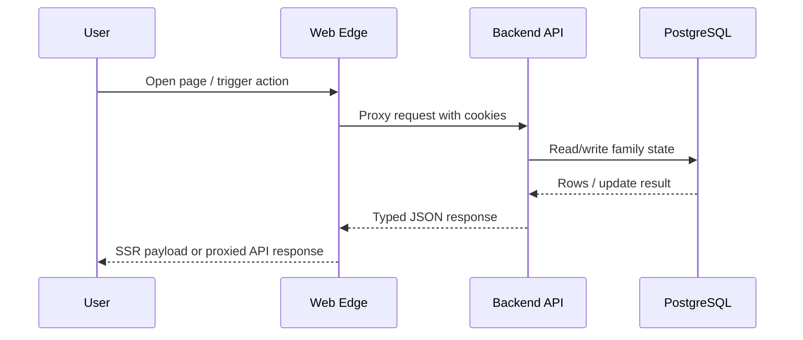
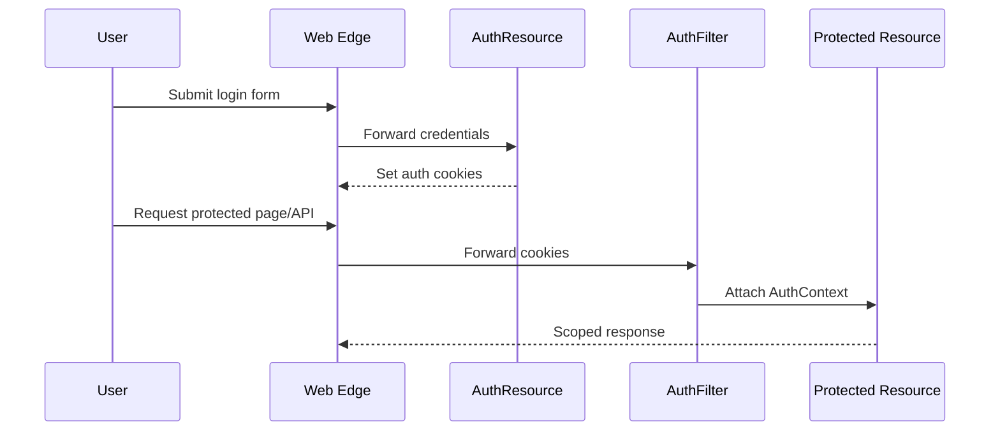
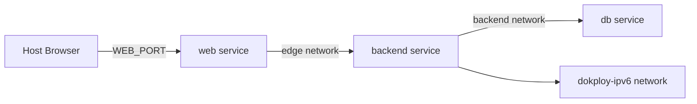

# EarnIt Kids Architecture

## Table of Contents

- [🌍 C4 Context](#-c4-context)
- [📦 C4 Container View](#-c4-container-view)
- [🧩 C4 Component View](#-c4-component-view)
- [🔄 Data Flow](#-data-flow)
- [🔐 Auth Flow](#-auth-flow)
- [🐳 Docker Networking](#-docker-networking)
- [🧾 Decision Log](#-decision-log)

## 🌍 C4 Context

EarnIt Kids sits between three primary actors and one data system.

- Parent users manage children, balances, tasks, requests, and limits.
- Child users complete tasks, request purchases, and review their own history.
- Super-admin users inspect families, backups, and system health.
- PostgreSQL stores the source of truth for family, child, catalog, history, request, and token data.

[↩ Back to toc](#table-of-contents)

## 📦 C4 Container View

The deployed system is intentionally split into a thin web edge and a stateful backend API.

- `apps/web/`: public pages, authenticated shell, same-origin `/api/*` proxy, `/healthz`, blog rendering, static verification assets
- `apps/backend/`: auth, session cookies, family dashboard payloads, transactional task/shop/request endpoints, backup tooling, OpenAPI
- `postgres`: primary relational store for runtime state and migrations
- `mobile/`: Capacitor packaging around the web runtime; not a separate backend client contract

[↩ Back to toc](#table-of-contents)

## 🧩 C4 Component View

Backend component responsibilities:

- `resource/`: HTTP boundary, auth checks, request/response mapping, OpenAPI annotations
- `service/`: business rules, transaction boundaries, orchestration, validation beyond DTO annotations
- `repository/`: database access, aggregation queries, persistence updates
- `domain/model/`: JPA entities
- `dto/request` and `dto/response`: external API contracts
- `config/` and `exception/`: auth filters, headers, JWT helpers, exception mappers

Frontend component responsibilities:

- `src/routes/`: page routes, server load functions, edge proxy endpoints
- `src/lib/components/app/`: authenticated shell and role-specific sections
- `src/lib/services/`: client API wrapper, bootstrap, save queue, PWA, push, websocket
- `src/lib/server/`: server-only config, proxy, session bootstrap, blog loading
- `src/lib/stores/`: app state, tabs, modals, toasts
- `src/lib/types/`: shared runtime types for session and config

[↩ Back to toc](#table-of-contents)

## 🔄 Data Flow

The main user path is intentionally same-origin.

1. Browser requests a page from SvelteKit.
2. SvelteKit resolves route data and reads the session snapshot.
3. Client actions call same-origin `/api/*` routes through the web edge.
4. The web edge forwards the request to Quarkus with cookies and headers intact.
5. Quarkus validates auth, applies service logic, persists to PostgreSQL, and returns a typed DTO.
6. The frontend normalizes the payload into stores and re-renders the active section.

[↩ Back to toc](#table-of-contents)

## 🔐 Auth Flow

Authentication is cookie-based and role-aware.

- Parent/admin login starts at `POST /api/login`.
- Child login starts at magic-link or token-based child routes.
- The backend signs compatibility JWT cookies plus CSRF-related cookies.
- `AuthFilter` reconstructs `AuthContext` on every protected API request.
- Child sessions are always scoped server-side to their own `childId`; the UI is not trusted for authorization.

[↩ Back to toc](#table-of-contents)

## 🐳 Docker Networking

Two Compose entrypoints are maintained.

- `docker-compose.yml`: JVM backend build for day-to-day local development
- `docker-compose.native.yml`: native-image backend build for packaging validation

Failure modes to keep in mind:

- The `db` service is profile-gated, so local full-stack boots must include `--profile db`.
- Container-to-container URLs must stay on internal ports even when host port overrides change.
- `docker compose config` is the fastest way to catch env drift before a rebuild.

[↩ Back to toc](#table-of-contents)

## 🧾 Decision Log

### ADR-001: SvelteKit is the single active web runtime

- Decision: keep `apps/web` as the only supported web frontend.
- Why: it centralizes SSR, proxying, and static endpoints in one deployable Node runtime.

### ADR-002: Same-origin web edge stays in front of Quarkus

- Decision: browser traffic goes to the SvelteKit edge, not directly to Quarkus.
- Why: it simplifies cookies, CSP/security headers, proxying, and mobile/web parity.

### ADR-003: Quarkus remains the source of truth for family state

- Decision: frontend stores are cache/view state only; durable writes stay in the backend.
- Why: it prevents cross-role trust bugs and keeps transactional updates server-side.

### ADR-004: Unversioned `/api/*` remains current until a breaking contract is required

- Decision: keep the current stable API surface unversioned and introduce `/api/v2/*` only for future breaking changes.
- Why: the current system is single-client and same-origin, so forced prefix churn would add migration noise without immediate value.

[↑ Back to top](#top)
