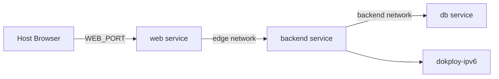

# EarnIt Kids — Docker Operations Guide

<a name="top"></a>

## 📚 Table of Contents

- [🧭 Overview](#-overview)
- [🚀 Compose Entrypoints](#-compose-entrypoints)
- [🔧 Environment Configuration](#-environment-configuration)
- [🌐 Networking Model](#-networking-model)
- [📋 Common Workflows](#-common-workflows)
- [⚠️ Failure Modes](#️-failure-modes)
- [🗑️ Cleanup](#️-cleanup)
- [🐳 Building Individual Images](#-building-individual-images)

---

## 🧭 Overview

EarnIt Kids uses Docker Compose to run the full stack locally. The stack consists of three services:

| Service | Role | Image Base |
| --- | --- | --- |
| `web` | SvelteKit SSR frontend | `node:23-alpine` via `apps/web/Dockerfile` |
| `backend` | Quarkus REST API | JVM (`Dockerfile.jvm`) or Native (`Dockerfile`) |
| `db` | PostgreSQL 18 | `postgres:18-alpine` (profile-gated) |

[↩ Back to toc](#table-of-contents)

## 🚀 Compose Entrypoints

Two Compose files are maintained for different backend modes:

### JVM Mode (default, day-to-day dev)

```bash
docker compose --profile db up -d --build
docker compose down
```

- Backend uses `apps/backend/Dockerfile.jvm` (faster build, JIT runtime).
- Best for local iteration and debugging.

### Native Mode (packaging validation)

```bash
docker compose -f docker-compose.native.yml --profile db up -d --build
docker compose -f docker-compose.native.yml down
```

- Backend uses `apps/backend/Dockerfile` (GraalVM native-image).
- Best for validating native packaging before deployment.
- ⚠️ First native build can take 5–10 minutes.

[↩ Back to toc](#table-of-contents)

## 🔧 Environment Configuration

All environment variables are sourced from `.env` in the repository root.

| Variable | Default | Used By |
| --- | --- | --- |
| `WEB_PORT` | `3000` | Host port for web service |
| `WEB_INTERNAL_PORT` | `3000` | Internal web container port |
| `BACKEND_INTERNAL_PORT` | `8080` | Internal backend container port |
| `DB_HOST_PORT` | `5432` | Host port for PostgreSQL |
| `DB_INTERNAL_PORT` | `5432` | Internal PostgreSQL port |
| `APP_URL` | `http://localhost:3000` | Public origin |
| `JWT_SECRET` | — | JWT signing secret |
| `DATABASE_URL` | `jdbc:postgresql://db:5432/earnit_kids` | Backend JDBC URL |
| `JAVA_XMX` | `2500m` | Native build memory cap |

> 📝 **Tip:** Override ports at launch without editing `.env`:
> ```bash
> WEB_PORT=4000 DB_HOST_PORT=5433 docker compose --profile db up -d
> ```

[↩ Back to toc](#table-of-contents)

## 🌐 Networking Model

Three Docker networks connect the services:



| Network | Scope |
| --- | --- |
| `edge` | Web ↔ Backend communication |
| `backend` | Backend ↔ Database communication |
| `dokploy-ipv6` | External network for Dokploy reverse-proxy (⚠️ do not remove) |

**Key rules:**

- Container-to-container traffic stays on **internal ports** (`WEB_INTERNAL_PORT`, `BACKEND_INTERNAL_PORT`), not host port overrides.
- The `db` service is **profile-gated** — always include `--profile db` when bringing up the stack.

[↩ Back to toc](#table-of-contents)

## 📋 Common Workflows

### Check compose config before rebuild

```bash
docker compose config          # JVM stack
docker compose -f docker-compose.native.yml config  # Native stack
```

> ✅ Catches env drift before a slow rebuild.

### View service logs

```bash
docker compose logs -f web       # Frontend logs
docker compose logs -f backend   # Backend logs
docker compose logs -f db        # Database logs
```

### Rebuild a single service

```bash
docker compose build --no-cache web
docker compose up -d web
```

### Run a database shell

```bash
docker compose exec db psql -U postgres -d earnit_kids
```

### Verify healthchecks

```bash
docker compose ps                    # Status of all services
curl http://localhost:3000/healthz   # Web health
curl http://localhost:8080/q/health/ready  # Backend readiness
```

[↩ Back to toc](#table-of-contents)

## ⚠️ Failure Modes

| Symptom | Likely Cause | Fix |
| --- | --- | --- |
| `service "db" not found` | Missing `--profile db` flag | Add `--profile db` to `up` command |
| `port is already allocated` | Host port conflict | Override `WEB_PORT` or `DB_HOST_PORT` |
| Backend can't connect to DB | Network or env variable mismatch | Run `docker compose config` and verify `DATABASE_URL` |
| Backend healthcheck fails | Migration error or startup timeout | Check logs: `docker compose logs backend` |
| Native build is very slow | First-time GraalVM compilation | Expected; subsequent builds use cache |
| `dokploy-ipv6` network error | Missing external network | Create it: `docker network create dokploy-ipv6` or remove the network from compose for local dev |

[↩ Back to toc](#table-of-contents)

## 🗑️ Cleanup

```bash
# Stop services (preserves volumes)
docker compose down

# Stop and delete volumes (⚠️ destroys database data)
docker compose down -v

# Prune unused Docker resources
docker system prune -f
```

[↩ Back to toc](#table-of-contents)

## 🐳 Building Individual Images

For CI or manual image builds:

```bash
# Backend JVM
docker build -f apps/backend/Dockerfile.jvm -t earnit-backend:latest .

# Backend Native
docker build -f apps/backend/Dockerfile -t earnit-backend-native:latest .

# Web
docker build -f apps/web/Dockerfile -t earnit-web:latest .
```

[↑ Back to top](#top)
